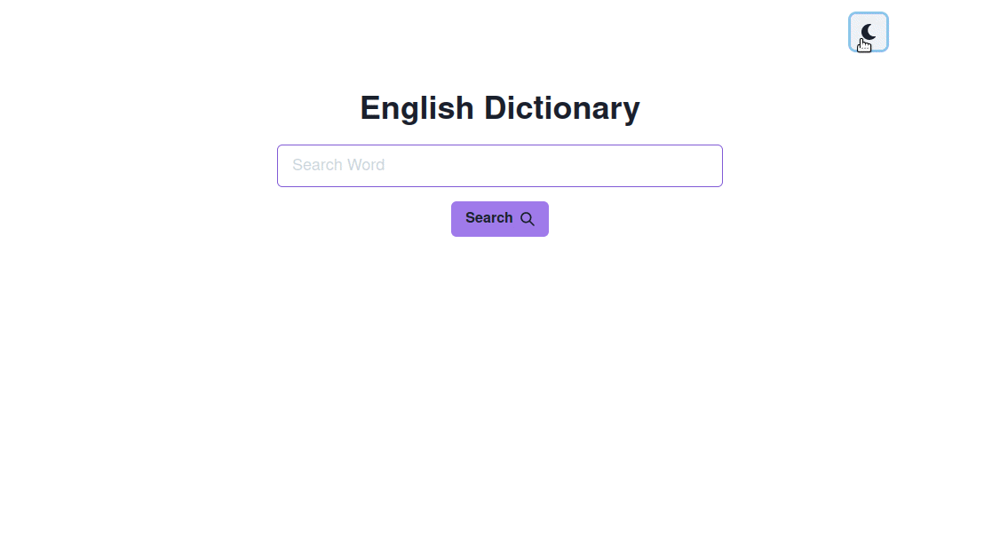

# Dictionary React App

a simple app that i've made to study React, Redux and Chackra UI.  
Search for a word pronunciation and definitions.



# Techs

- React
- Redux
- Chackra UI
- Third party API: [free dictiorary API](https://dictionaryapi.dev/)

# Install and Run

clone the repo:

```bash
git clone https://github.com/Bruends/dictionary-app.git
```

install the dependencies:

```
npm install
```

then run the app

```
npm start
```

it will open on `localhost:3000`
